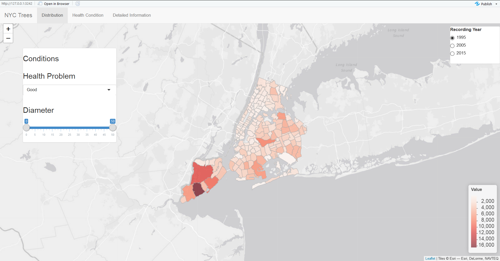

# Project 2: Shiny App Development Version 2.0

### [Project Description](doc/project2_desc.md)



In this second project of GR5243 Applied Data Science, we develop a version 2.0 of an *Exploratory Data Analysis and Visualization* shiny app on a topic of your choice using [NYC Open Data](https://opendata.cityofnewyork.us/) or 

## Project Title: NYC Trees
Term: Fall 2019

+ Team sec1-grp1
+ **NYC Trees**: 
	+ Ponkshe, Tushar tvp2110@columbia.edu
	+ Qiu, Feng fq2150@columbia.edu
	+ Wu, Bingquan bw2585@columbia.edu
	+ Zhang, Shijie sz2781@columbia.edu
	+ Zheng, Kaiyan kz2324@columbia.edu

+ **Dataset**: Due to the limitation of the maximum size of uploading files by Github, the dataset used in the project cannot be uploaded in the `data` file. However, the [integrated datset](data/combineddata.csv) is contained. The original datasets can be found on [NYC Open Data](https://opendata.cityofnewyork.us/). Linked bewlow:
  + [1995 Street Tree Census](https://data.cityofnewyork.us/Environment/1995-Street-Tree-Census/7gmq-dbas)
  + [2005 Street Tree Census](https://data.cityofnewyork.us/Environment/2005-Street-Tree-Census/ye4j-rp7z)
  + [2015 Street Tree Census](https://data.cityofnewyork.us/Environment/2015-Street-Tree-Census-Tree-Data/pi5s-9p35) 

+ **Project summary**: This shinyapp provides a directive visualizaiton of trees distribution in New York City, as well as the basic health condition of trees and diameter of breast height in different districts. According to the dataset used in the project, most trees in New York City are planted in the Statent Island while Manhattan is the area with the least trees planted if trees in Central Park are not accounted. In each district of New York City, trees are mostly in "Good" condition with approximately 5 inch diameter at breast height.

+ **Contribution statement**: 
  + Overall: Bingquan Wu provides the idea of the tree dataset and its source. Ponkshe, Tushar creates the basic frame of the app. Feng Qiu improves the detailed output and layout of the shinyapp as well as the Github page.
  + Panel 1: Ponkshe, Tushar insert the defalut leaflet map. Shijie Zhang integrates the data to form the leafletoup map. Feng Qiu added the control panels.
  + Panel 2&3 : Bingquan Wu plotted the tree ggplot map. Feng Qiu creates the control panels and the output layout.
  + Presentation: Ponkshe, Tushar is the presenter.
  
Following [suggestions](http://nicercode.github.io/blog/2013-04-05-projects/) by [RICH FITZJOHN](http://nicercode.github.io/about/#Team) (@richfitz). This folder is orgarnized as follows.

```
proj/
|-- app/
|-- lib/
|-- data/
|-- doc/
|-- output/
```

Please see each subfolder for a README file.

